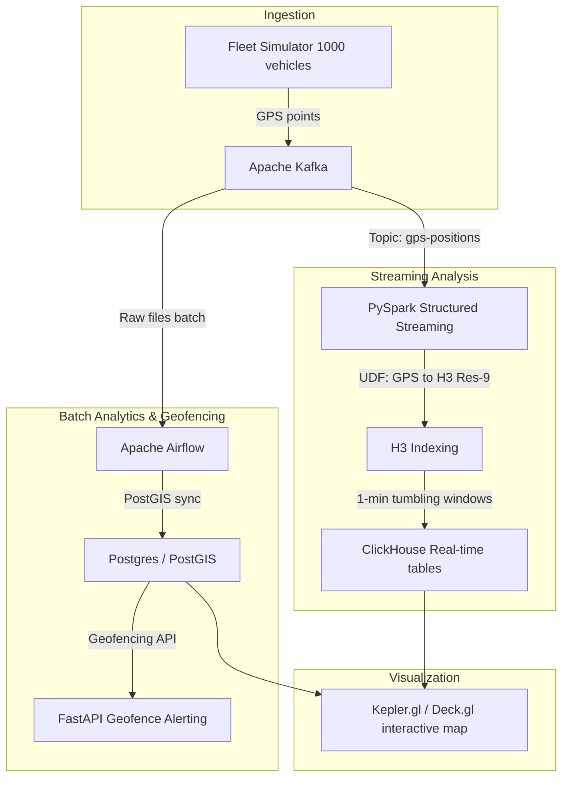

# Architecture — Géospatial H3 Mobility

Cette plateforme traite les flux géospatiaux de télémétrie en temps réel (100M+ points GPS/jour) provenant d'une flotte de véhicules. Elle utilise la discrétisation spatiale Uber H3 pour standardiser les analyses géographiques.

## Diagramme d'Architecture

## Description des Composants

### 1. Ingestion de Flotte (Simulateur & Kafka)
- **Simulateur de Véhicules** : Génère des positions GPS (latitude, longitude, vitesse, cap, batterie, altitude) pour 1000 véhicules toutes les 5 secondes.
- **Apache Kafka** : Reçoit les messages sur le topic `gps-positions` et permet un traitement distribué par partition.

### 2. Indexation Spatiale & Streaming (PySpark H3)
- Le job Spark streaming `h3_aggregation.py` consomme les messages en temps réel.
- **Uber H3 UDF** : Convertit instantanément les coordonnées de latitude/longitude en cellules hexagonales H3 (résolution 9, taille idéale pour la mobilité urbaine).
- **Agrégation en fenêtre glissante** : Agrégation de la vitesse moyenne, du nombre de points et du nombre de véhicules uniques par cellule H3 toutes les minutes (avec un watermark de 30 secondes pour gérer les retards de réseau).

### 3. Analytics Temporel et Batch (PostGIS / ClickHouse)
- **ClickHouse** : Utilisé pour le stockage analytique en temps réel des données hexagonales pour des requêtes de densité instantanées.
- **PostGIS** : Stocke les polygones de geofencing (zones autorisées ou interdites) et permet de valider les alertes géospatiales complexes via une API FastAPI dédiée.

### 4. Visualisation (Kepler.gl)
- La configuration de Kepler.gl permet d'afficher en direct des heatmaps hexagonales en 3D basées sur les cellules H3 générées par Spark.

## Choix Technologiques & ADRs (Architecture Decision Records)

### ADR 1 : Indexation hexagonale Uber H3 vs QuadTree/Grilles
- **Alternative** : Geohash, grilles cartésiennes régulières.
- **Décision** : Uber H3 (Hexagones).
- **Raison** : Les hexagones ont une distance constante entre les centres de toutes les cellules voisines (contrairement aux carrés ou geohashes où la distance diagonale est différente). Cela rend les calculs de trajectoires, de zones de chalandise et de recherche de voisins beaucoup plus précis et performants.

### ADR 2 : ClickHouse pour le stockage de séries temporelles géospatiales
- **Alternative** : PostgreSQL traditionnel.
- **Décision** : ClickHouse.
- **Raison** : ClickHouse offre des performances d'écriture en masse et de compression de données tabulaires très supérieures pour gérer les millions de points de télémétrie géographique reçus chaque jour.
